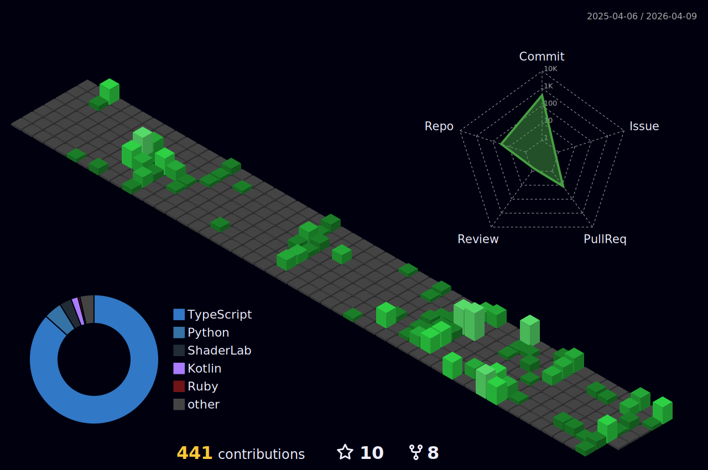

### 
Hi  I'm seongwon

 
  

 

 

 

<!--  GIf -->

### Programing Languages:

	 

### Github Stats:

 |  
:-------------------------:|:-------------------------:
 |  

### Github contribution:
	  
    
<h4 align="center">Isometric view of contributions in the last year.</h4>
	  

	

