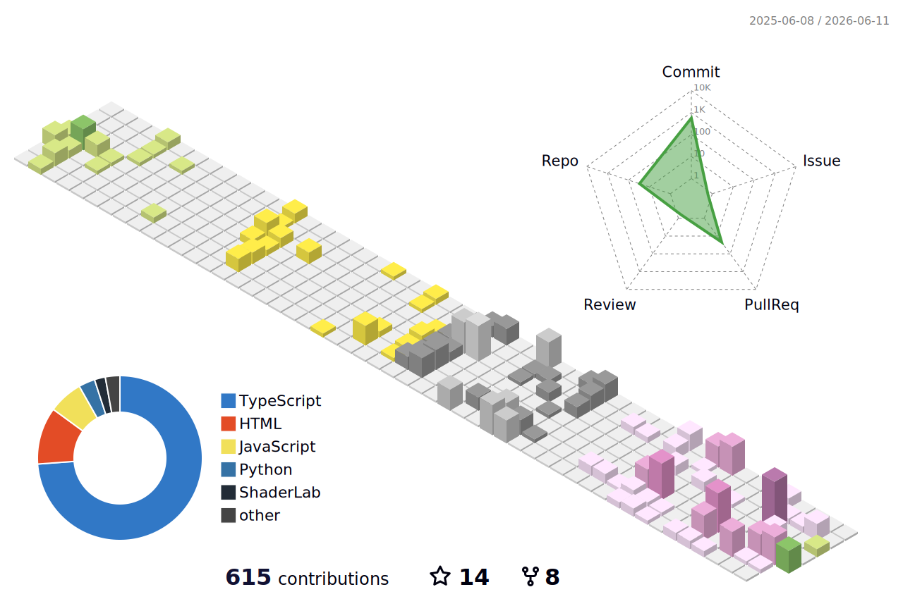

 

  

 

## About

**Software engineer** in Seoul. I work mostly on **backend services** (Node.js / **NestJS**), **TypeScript**, REST/GraphQL-style APIs, and **data stores** (PostgreSQL, Redis, MongoDB). I also maintain a **Korean NLP** helper for Node (**mecab-sw**), small **Python** utilities, and **ORM / infra** experiments.

Portfolio: **[magiof.github.io](https://magiof.github.io)** · Email: **tjddnjs7559@gmail.com**

### Stack

### Selected repositories

| | |
|:---|:---|
| [**mecab-sw**](https://github.com/Magiof/mecab-sw) | MeCab wrapper for Node.js — Korean morphological analysis with **mecab-ko**. |
| [**nestjs_boiler_plate**](https://github.com/Magiof/nestjs_boiler_plate) | NestJS **boilerplate** and API structure experiments. |
| [**Hi-Nest**](https://github.com/Magiof/Hi-Nest) | **NestJS** API course / enterprise-style backend practice. |
| [**performance-benchmarks-prisma5-typeorm**](https://github.com/Magiof/performance-benchmarks-prisma5-typeorm) | **Prisma vs TypeORM** performance benchmarks. |
| [**commit-message-maker**](https://github.com/Magiof/commit-message-maker) · [**homebrew-commit-message-maker**](https://github.com/Magiof/homebrew-commit-message-maker) | **Python** CLI for commit messages + **Homebrew** tap. |
| [**duplicate_image_remover**](https://github.com/Magiof/duplicate_image_remover) | **Python** tool to find and remove duplicate images. |
| [**FocusGarden**](https://github.com/Magiof/FocusGarden) | **TypeScript** — team focus / productivity tooling. |
| [**Beyond-Syntax**](https://github.com/Magiof/Beyond-Syntax) | **TypeScript** language & tooling experiments. |
| [**Magiof.github.io**](https://github.com/Magiof/Magiof.github.io) | Personal **site** (HTML/CSS/JS). |

Forks I contribute to or watch include **OpenSpace** (agents), **manseryeok-js** (Korean lunar calendar), and others — see the full list on [repositories](https://github.com/Magiof?tab=repositories).

 

### Automation

**Actions tab missing?** On a **fork**, open **Settings → Actions → General** and allow workflows, then run each workflow once manually. For a **3D graph that includes private activity**, enable “Include private contributions” in [profile settings](https://github.com/settings/profile#contributions-setting) or use a PAT as <code>GITHUB_TOKEN</code> in [profile-3d.yml](.github/workflows/profile-3d.yml) (see comment there).

 

### Snake contribution

SVGs on <code>main</code> in <code>dist/</code>. Run **Actions → Generate snake** if files are missing.

<picture>
  <source media="(prefers-color-scheme: dark)" srcset="dist/github-contribution-grid-snake-dark.svg" />
  <source media="(prefers-color-scheme: light)" srcset="dist/github-contribution-grid-snake.svg" />
  
</picture>

 

### GitHub metrics

<table>
<tr>
<td width="50%" valign="top">

</td>
<td width="50%" valign="top">

</td>
</tr>
</table>

 

### Contribution landscape

Regenerated on a schedule with <a href="https://github.com/yoshi389111/github-profile-3d-contrib">github-profile-3d-contrib</a> — run the workflow once if the graph looks outdated.

